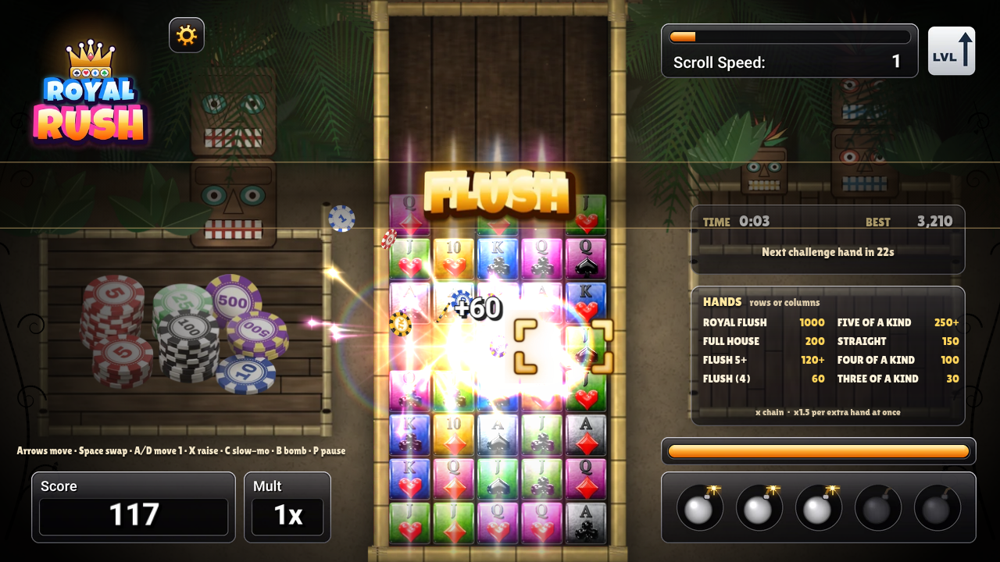
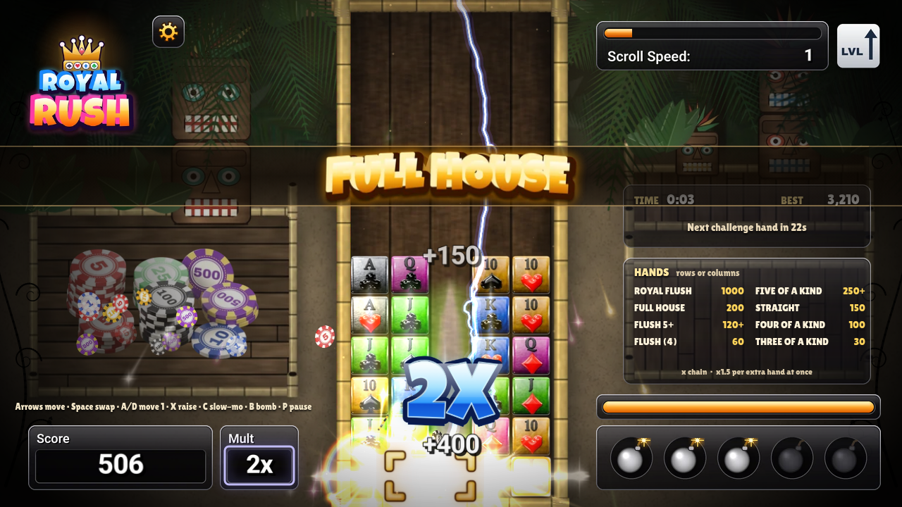
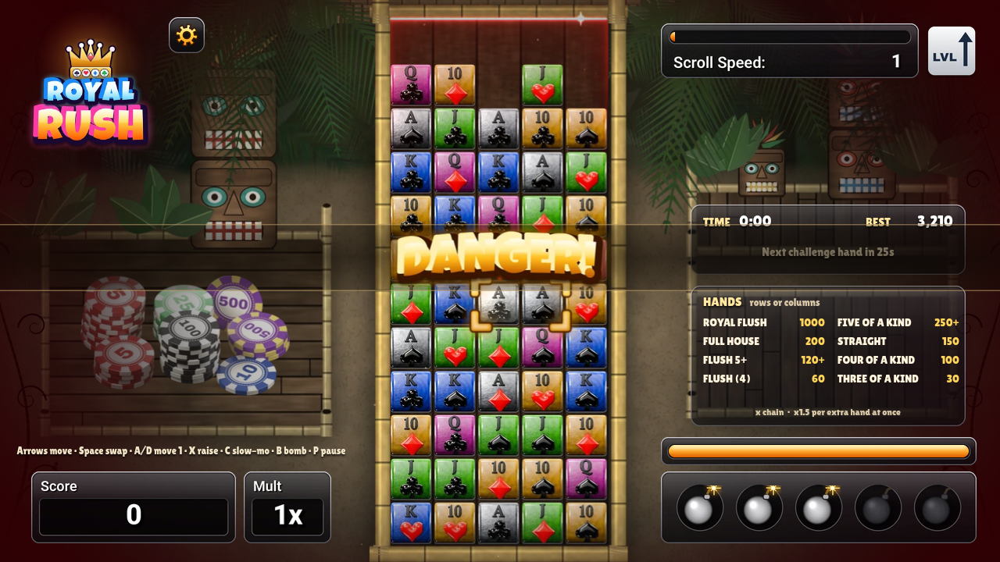

# Royal Rush

## [▶ Play Royal Rush](https://labfreak-dev.github.io/royal-rush/)

**Play it in your browser at https://labfreak-dev.github.io/royal-rush/.** There's nothing to install, and it works offline as a single HTML file.

A rising-stack poker puzzle game for the browser. A stack of playing cards (10, J, Q, K and A in four suits) climbs up a 5 × 12 board. Slide cards sideways to make poker hands in any row or column. Each hand clears, the cards above fall into the gaps, and a new hand formed by falling cards starts a chain. If the stack reaches the top, the game is over.

Cards are glossy blocks coloured by rank, so you can read the board at a glance: **10 gold, J green, Q pink, K blue, A silver**. The suit symbol on each card is used for flushes. The game is set in a moody, lamp-lit tiki jungle with a spotlit board, dark vignette corners and drifting dust. Matched cards glow orange, flash white, then burst one at a time in warm fire glows with starbursts, light pillars, smoke and glinting sparks, and the chips they held fly out onto the chip table. Every chain link calls down a lightning strike and a big chrome-blue 2X/3X, and big combos punch the camera in with a burst of light.

Inspired by a classic 2008 Xbox Live Arcade card puzzle game.

## How to play

- Cards only move **horizontally**, **one space per move**. Swap the card under the cursor with its neighbour, or move it one space left or right.
- Make a hand of **3 or more cards in a straight line**, in a row or a column. It flashes, clears, and scores.
- Cards above a cleared hand fall. If they land in a new hand, that's a **chain**, and every link multiplies the score.
- Clearing two or more hands at once earns a **shape bonus**.
- The stack rises all the time and speeds up each level. It pauses briefly while cards clear.
- A **challenge hand** appears now and then. Make the named hand before the timer runs out for bonus points.

### Hands and points

| Hand | What it takes (in one row or column) | Points |
|---|---|---|
| Royal Flush | 10 J Q K A of one suit, in any order | 1000 |
| Five of a Kind | 5 cards of the same rank (+150 for each extra card) | 250+ |
| Full House | 3 of one rank + 2 of another, within 5 cards | 200 |
| Straight | 10 J Q K A, in any order | 150 |
| Flush (5+) | 5 or more cards of one suit (+80 for each extra card) | 120+ |
| Four of a Kind | 4 cards of the same rank | 100 |
| Flush | 4 cards of one suit | 60 |
| Three of a Kind | 3 cards of the same rank | 30 |

**Score** = hand points × chain number × shape bonus (×1.5 for each extra hand cleared at once) × level bonus (+10% per level).

## Controls

| Key | Action |
|---|---|
| Arrow keys | Move the cursor |
| Space / Z | Swap the selected card with its neighbour |
| A / D | Move the selected card one space left / right (one space per press) |
| X / Shift (hold) | Raise the stack faster |
| C (hold) | Slow-mo (uses the energy bar) |
| B | Bomb the selected card (start with 3, max 5, earn more by scoring) |
| P / Esc | Pause (the pause menu has Resume, Settings and Menu) |
| ⚙ gear (top left, in game) | Pause and open Settings |
| M | Mute music and sound effects |
| Mouse / touch | Click a card, then its neighbour, to swap them, or drag a card one space sideways (one swap per drag) |

## Settings

Open **Settings** from the main menu, from the pause menu, or with the gear button in the top-left corner during a game.

- **Full screen:** fills the screen and keeps the board letterboxed. Esc or F11 also exits. The option is disabled where the browser has no Fullscreen API (for example iPhone Safari).
- **Reduce flashing:** removes the white clear flashes, the whole-board flash, tile squash-and-stretch, screen shake, lightning strikes, light bursts, the camera zoom punch and the flickering danger pulse. Fire glows are softened and the red danger edges stay steady. Clears become a soft fade with faint starbursts, and the danger zone gets a steady red tint.
- **Sound effects / Music:** separate volume sliders from 0 to 100 % in steps of 10 (M still mutes everything).

Use the mouse or touch (click toggles, click or drag sliders) or the keyboard: arrow keys to move and adjust, Enter/Space to toggle, Esc or B to go back. Settings are saved in your browser.

## Modes

- **Action:** endless. The stack speeds up every 30 seconds. Survive as long as you can.
- **Timed:** score as much as you can in 3 minutes.

Your best score for each mode is saved in your browser.

## Audio

The game has looping lounge music for the menu, gameplay and danger mode (it crossfades into a faster track when the stack nears the top), and sound effects for swaps, landings, rising rows, every hand, chains, level-ups and game over. Sound starts after your first click or key press (browser autoplay rules). Pausing ducks the music, and **M** mutes everything. Browsers that can't play Ogg Vorbis (Safari older than 17) get simple built-in sound effects and no music.

## Files

- `index.html` / `royal-rush.html`: the complete game, one self-contained file with all art embedded.
- `media/`: screenshots (title, gameplay, a clear mid-animation, a chain, danger mode).
- `tools/`: `royal-rush.src.html` (game source) and `assets.json` (embedded art and audio bundle). Run `python3 tools/build_html.py` to rebuild both HTML files from them.

## Credits

Art: original art made for this project. Audio: original music and sound effects made for this project; music created with ElevenLabs. Fonts: Luckiest Guy (Apache 2.0) and Lilita One (SIL OFL 1.1).
