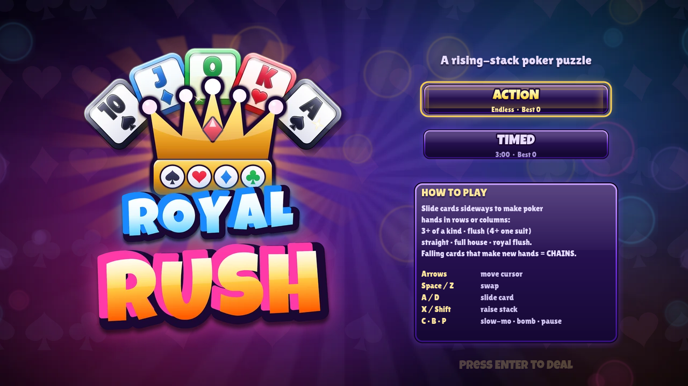
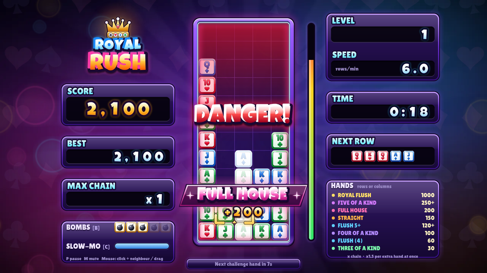

# Royal Rush

## [▶ Play Royal Rush](https://labfreak-dev.github.io/royal-rush/)

**Play it in your browser at https://labfreak-dev.github.io/royal-rush/.** There's nothing to install, and it works offline as a single HTML file.

A rising-stack poker puzzle game for the browser. A stack of playing cards (10, J, Q, K and A in four suits) climbs up a 5 × 12 board. Slide cards sideways to make poker hands in any row or column. Each hand clears, the cards above fall into the gaps, and a new hand formed by falling cards starts a chain. If the stack reaches the top, the game is over.

Inspired by a classic 2008 Xbox Live Arcade card puzzle game.

## How to play

- Cards only move **horizontally**. Swap the card under the cursor with its neighbour, or slide it along the row.
- Make a hand of **3 or more cards in a straight line**, in a row or a column. It flashes, clears, and scores.
- Cards above a cleared hand fall. If they land in a new hand, that's a **chain**, and every link multiplies the score.
- Clearing two or more hands at once earns a **shape bonus**.
- The stack rises all the time and speeds up each level. It pauses briefly while cards clear.
- A **challenge hand** appears now and then. Make the named hand before the timer runs out for bonus points.

### Hands and points

| Hand | What it takes (in one row or column) | Points |
|---|---|---|
| Royal Flush | 10 J Q K A of one suit, in any order | 1000 |
| Five of a Kind | 5 cards of the same rank (+150 for each extra card) | 250+ |
| Full House | 3 of one rank + 2 of another, within 5 cards | 200 |
| Straight | 10 J Q K A, in any order | 150 |
| Flush (5+) | 5 or more cards of one suit (+80 for each extra card) | 120+ |
| Four of a Kind | 4 cards of the same rank | 100 |
| Flush | 4 cards of one suit | 60 |
| Three of a Kind | 3 cards of the same rank | 30 |

**Score** = hand points × chain number × shape bonus (×1.5 for each extra hand cleared at once) × level bonus (+10% per level).

## Controls

| Key | Action |
|---|---|
| Arrow keys | Move the cursor |
| Space / Z | Swap the selected card with its neighbour |
| A / D | Slide the selected card left / right |
| X / Shift (hold) | Raise the stack faster |
| C (hold) | Slow-mo (uses the energy bar) |
| B | Bomb the selected card (start with 3, max 5, earn more by scoring) |
| P / Esc | Pause |
| M | Mute |
| Mouse / touch | Click a card, then its neighbour, to swap them, or drag a card sideways |

## Modes

- **Action:** endless. The stack speeds up every 30 seconds. Survive as long as you can.
- **Timed:** score as much as you can in 3 minutes.

Your best score for each mode is saved in your browser.

## Files

- `index.html` / `royal-rush.html`: the complete game, one self-contained file with all art embedded.
- `media/`: screenshots.
- `tools/`: `royal-rush.src.html` (game source) and `assets.json` (embedded art bundle). Run `python3 tools/build_html.py` to rebuild both HTML files from them.

## Credits

Art: original art made for this project. Fonts: Luckiest Guy (Apache 2.0) and Lilita One (SIL OFL 1.1).
